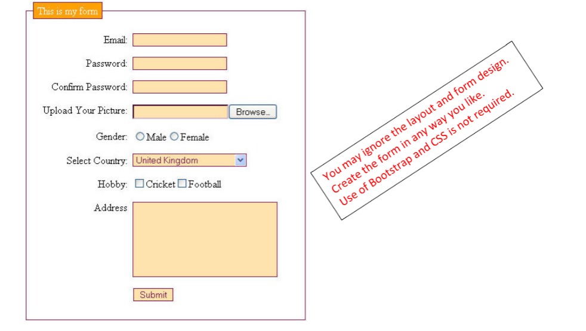

# web_tools_servlets_assignment

## Part 1. Reading Assignment

http://pdf.coreservlets.com/HTTP-Request-Headers.pdf
http://pdf.coreservlets.com/HTTP-Status-Codes.pdf
If the sitde is down, then here is the link to the whole book: https://learning.oreilly.com/library/view/-/0130092290/?ar=
To login: select, Northeastern University not listed. Then enter your email as "username@northeastern.edu"

## Part 2. Programming Assignment

Write a servlet, to be created and deployed manually without using any IDE to display request headers using:
Enumeration getHeaderNames()
Enumeration getHeaders(String name)
https://docs.oracle.com/javaee/7/api/javax/servlet/http/HttpServletRequest.html

## Part 3. Programming Assignment

Create an HTML to display the following form. The design/layout do not need to be the same as the form below. Just provide the
same fields. You may ignore the layout, but if you know Bootstrap/CSS, you may use it. Write a servlet to display the submitted data.

## PART 4. Programming Assignment

Create an HTML form to capture the information as shown in the following PDF page. PDF forms are designed to print and fill out by hand, so the layout is optimized to fit all the fields in a single page, but there is no such a requirement for the layout for the web forms.
So, the design and layout of the form may be very different from the PDF form. Design the web form in any way you like, using CSS libraries if you like, to capture the same information. Also, in the layout, you may see underlined fields or table cells for users to write information, but you cannot capture user input from an HTML page just by underlining or creating a table cell. A form element is needed for users to enter information.
https://assets.hrm.northeastern.edu/pdfs/tuition_waiver/TuitionWaiverForm.pdf

## PART 5. Programming Assignment

Create a servlet to use and display all the getX() methods from the HttpServletRequest class:
https://javaee.github.io/javaee-spec/javadocs/javax/servlet/http/HttpServlet.html
and all the inherited getX() methods from the super interface ServletRequest:
https://javaee.github.io/javaee-spec/javadocs/javax/servlet/ServletRequest.html
If a getX() method returns something that cannot be printed, just skip that method.
